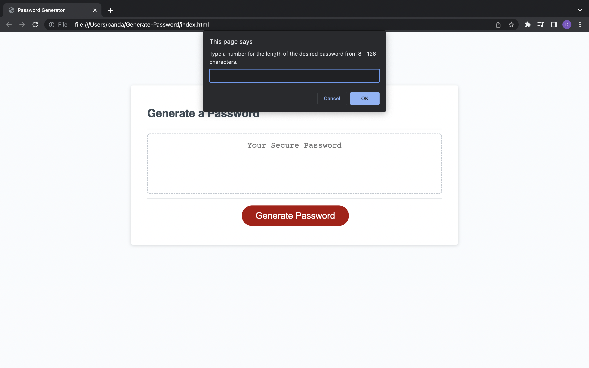
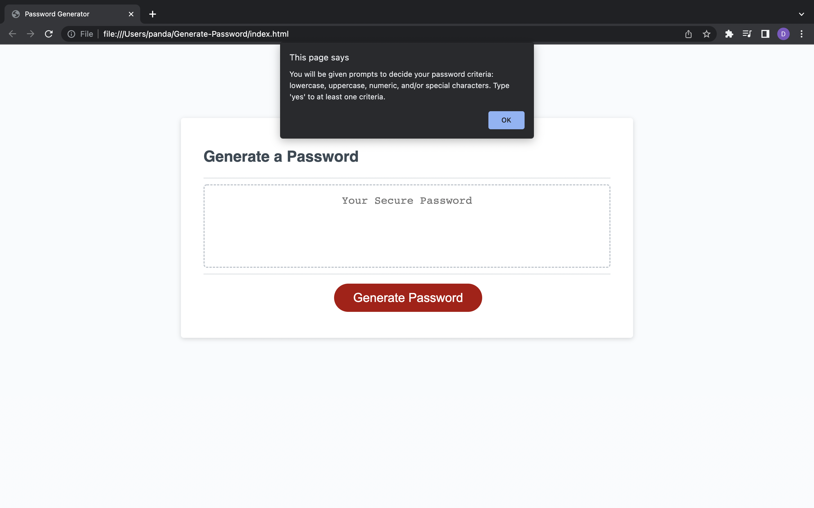
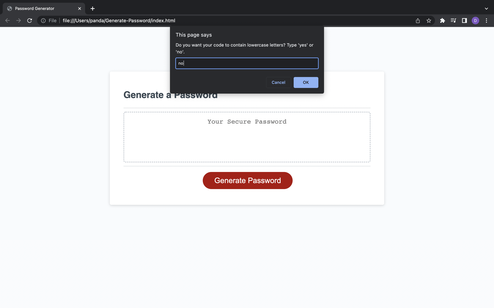
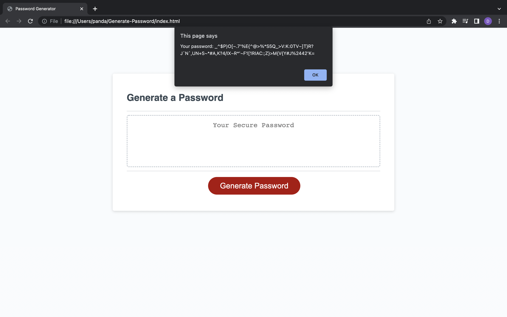
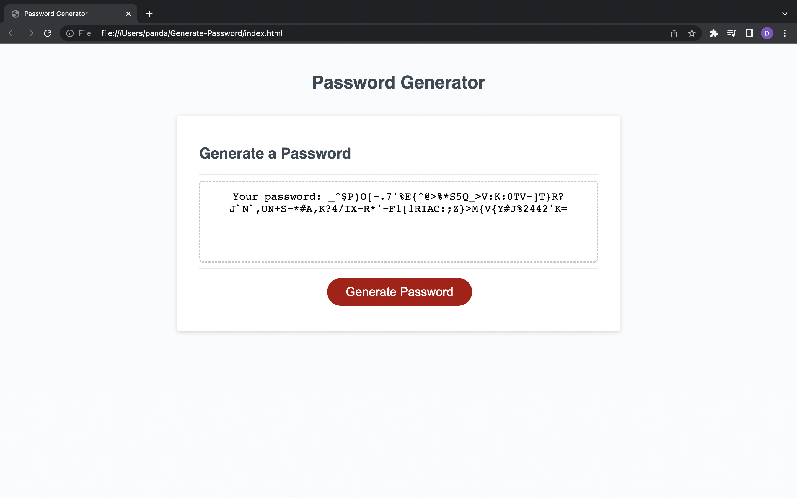

# Generate-Password

<h2>Description</h2>
  

This webpage generates a random password. The password given is based on user inputs. The user decides the length of the password and the criteria (lowercase letters, uppercase letters, numbers, and/or special characters).

  
<h2>Screenshots<h2>

<h2>Link</h2>

<a href="https://dcontrer83.github.io/Generate-Password/">Generate Password</a>